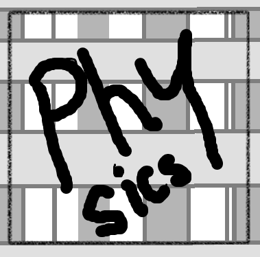

# Gravity Simulator C++

A C++ physics simulation that models gravitational interactions between celestial bodies.

 <!-- Add a screenshot if available -->

## Features

- N-body gravitational simulation
- Real-time visualization
- Configurable physical parameters

## Prerequisites
- CMake 3.15+
- C++20 compatible compiler

## 🚀 Installation & Build

```py
# Run the batch file
setup.bat
```
[ Note: You only need to do this once ]

After that you can continue:

### For Visual Studio (MSVC)

```bash
# Debug configuration
cmake --preset windows64-VS-Debug && cmake --build build/windows64-VS-Debug

# Release configuration
cmake --preset windows64-VS-Release && cmake --build build/windows64-VS-Release
```

### For GCC/Ninja

```bash
cmake --preset windows64-GCC-Debug && cmake --build build/windows64-GCC-Debug
```


## 🤝Contributing

Pull requests are welcome. Please open an issue first to discuss proposed changes.

## 📜[LICENSE](./LICENSE.txt)

## ⭐ Star this repo if you find it useful

"We are all in the gutter, but some of us are looking at the stars." - Oscar Wilde

## 🐛 Report issues in our Issue Tracker

Thank you for using Gravity Simulator! ❤️
